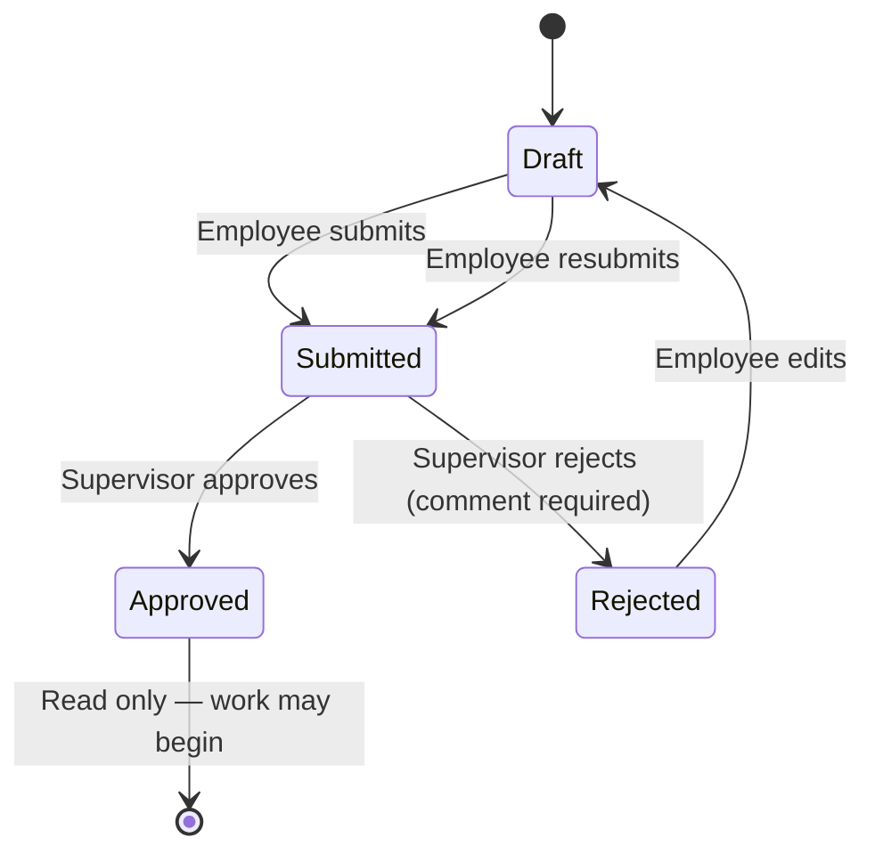
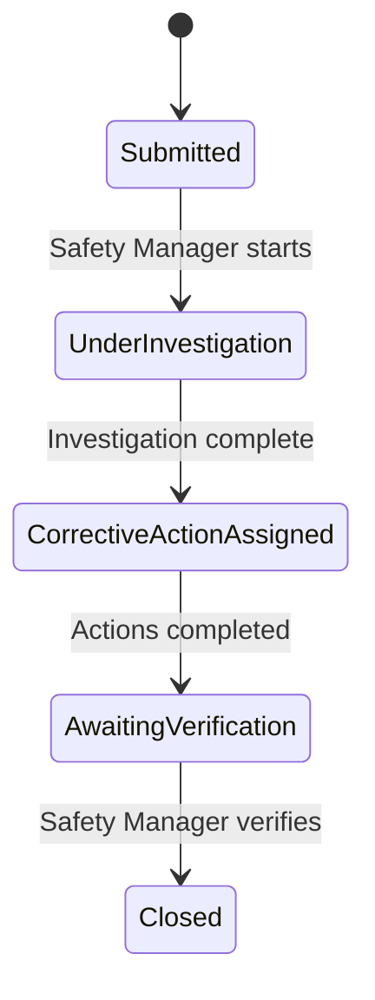
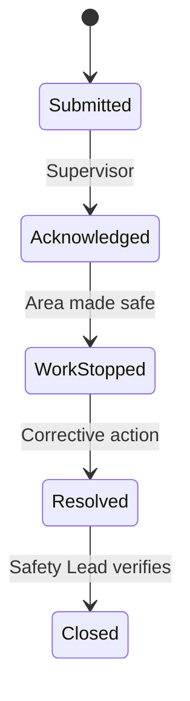
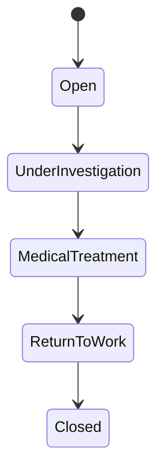
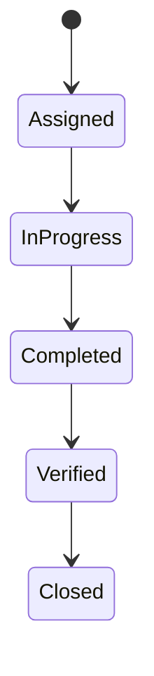

# Job Safety Pro — Business Workflows

End-to-end lifecycle workflows for all safety modules. Every state transition is audited and triggers notifications where required.

## 1. Job Safety Assessment (JSA)

| Transition | Actor | API |
|------------|-------|-----|
| Save draft | Employee | `POST /api/v1/jsas/drafts` |
| Submit | Employee | `POST /api/v1/jsas/{id}/submit` |
| Approve | Supervisor | `POST /api/v1/workflows/jsas/{id}/approve` |
| Reject | Supervisor | `POST /api/v1/workflows/jsas/{id}/reject` |
| Review | Supervisor | `GET /api/v1/workflows/jsas/{id}/review` |

**Notifications:** Submitted → Supervisor, Safety Manager · Approved/Rejected → Employee

---

## 2. Near Miss

| Status | Value |
|--------|-------|
| Draft | 0 |
| Submitted | 1 |
| UnderInvestigation | 2 |
| CorrectiveActionAssigned | 3 |
| AwaitingVerification | 4 |
| Closed | 5 |

---

## 3. Stop Unsafe Work

**Immediate notify:** Supervisor, Safety Officer, Safety Manager

| API | Role |
|-----|------|
| `POST /stop-unsafe-work/{id}/acknowledge` | Supervisor |
| `POST /stop-unsafe-work/{id}/work-stopped` | Supervisor |
| `POST /stop-unsafe-work/{id}/resolve` | Supervisor |
| `POST /stop-unsafe-work/{id}/close` | Safety Lead |

---

## 4. Injury

**Capture:** Safety Manager / Safety Officer only · **IFD reset** on create · Notify managers on capture

---

## 5. Corrective Action

**Overdue:** Background job notifies assignee, Supervisor, Safety Manager

---

## 6. Notification Center

| Type | Trigger |
|------|---------|
| AssessmentSubmitted | JSA submitted |
| AssessmentApproved | JSA approved |
| AssessmentRejected | JSA rejected |
| NearMissSubmitted | Near miss reported |
| CorrectiveActionAssigned | Action assigned |
| CorrectiveActionCompleted | Action completed |
| CorrectiveActionOverdue | Past due date |
| UnsafeWorkReported | Stop work reported |
| InjuryCaptured | Injury recorded |

| API | Description |
|-----|-------------|
| `GET /api/v1/notifications` | Inbox |
| `GET /api/v1/notifications/unread-count` | Bell badge |
| `POST /api/v1/notifications/{id}/read` | Mark read |

---

## 7. Manager Dashboard Actions

`GET /api/v1/workflows/dashboard/pending-actions`

Returns counts and items for: pending JSA approvals, near misses awaiting investigation, overdue corrective actions, open injuries, open stop-work reports.

---

## 8. Audit Trail

`GET /api/v1/workflows/audit/{entityType}/{entityId}`  
`GET /api/v1/workflows/audit/recent`

Every workflow transition logs: user, action, module, old/new values, timestamp.

---

## 9. Role Responsibilities

| Role | Capabilities |
|------|----------------|
| **Employee** | Create/submit JSA, report near miss & unsafe work, view own history |
| **Supervisor** | Approve/reject JSA, acknowledge stop work, complete corrective actions |
| **Safety Officer** | Capture injuries, investigate, verify corrective actions |
| **Safety Manager** | Full safety operations, investigations, verification, reports |
| **HSE Manager** | Near miss investigation, JSA approval, oversight |
| **Administrator** | User management + all safety lead capabilities |
